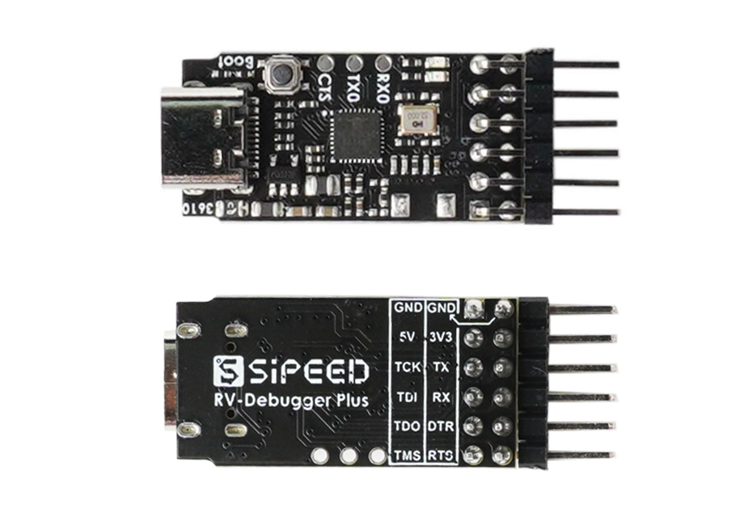

# Description

**RV-Debugger-BL702** is an opensource project that implement a JTAG+UART debugger with BL702C-A0.

[BL702](https://www.bouffalolab.com/bl70X) is highly integrated BLE and Zigbee combo chipset for IoT applications, contains **32-bit RISC-V** CPU with FPU, frequency up to **144MHz**, with **132KB RAM** and **192 KB ROM**, 1Kb eFuse, **512KB embedded Flash**, USB2.0 FS device interface, and many other features.

The firmware implement is inspired by [open-ec](https://github.com/rgwan/open-ec), implement by Sipeed teams and community developers.

The firmware emulate an [FT2232D](https://ftdichip.com/products/ft2232d/) device, defaultly implement an JTAG+UART debugger, and can be implement as a Dual-Serial Port debugger, a bluetooth debugger, etc.

Community Forum:  bbs.sipeed.com

## Clone

~~~shell
git clone --recursive {git link}
~~~

## Hardware

### Offical Board

Sipeed RV-Debugger-Plus  (BL702C-A0)

Purchase link: taobao.com/xxx

Schematic: [BL702_USB2JTAG_3610_sch.pdf](hardware/BL702_USB2JTAG_3610_sch.pdf)

Assembly: [BL702_USB2JTAG_3610_asm.pdf](hardware/BL702_USB2JTAG_3610_asm.pdf)

(LED0 is the led close to edge, indicate for RX)

 

## Firmware

### Default usb2uartjtag

Support JTAG+UART function

UART support baudrate below 2Mbps, and 3Mbps, and some experimental baudrate (stability is not guaranteed):

~~~txt
12M, 9.6M, 8M, 6.4M, 6M, 4.8M, 4M, 3.2M
we remap baudrate in 10000~12000 to (baud-10000)*10000
for example, 11200bps -> 12Mbps
~~~

LED0 for RX indication, LED1 for TX indication.

JTAG function is verified for :

- RV32 Xuantie E906/E907
- RV64 Xuantie C906
- Gowin FPGA GW1N-1, GW1NS-4C. (need enable GOWIN_INT_FLASH_QUIRK)

## Develop Guide

Open terminal inside "firmware\bl_mcu_sdk" directory and use next commands

### Build

~~~shell
make APP_DIR=../app APP=usb2uartjtag
~~~

### Flash

Press "boot" button then plug usb cable, and you will see "CDC Virtual ComPort" in device manager , remember the com number.

~~~shell
make download COMx=COM{NUM} FIRMWARE=out/usb2uartjtag/usb2uartjtag_bl702.bin
~~~
